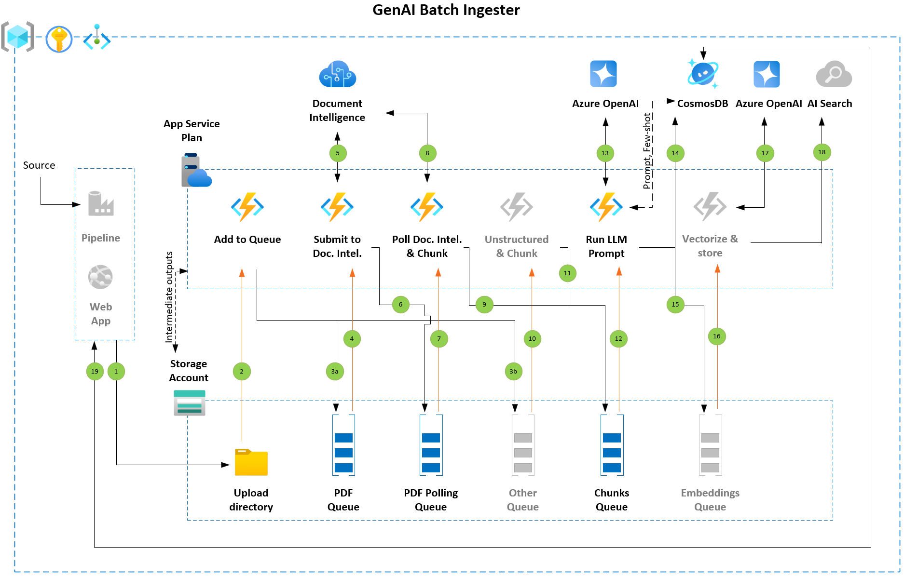

## GenAI-Batch-Ingester

The GenAI-Batch-Ingester pattern is an innovative solution designed to address the complexities and challenges associated with the bulk processing and ingestion of documents from historic and ongoing perspective, ranging from a few hundred to tens of millions.

This pattern is built upon the robust foundation provided by Azure Cloud services, harnessing the power of Azure Functions, Storage Queues, Azure Document Intelligence, Azure OpenAI, CosmosDB, and Azure Storage. It is designed to streamline the process of data ingestion, offering both scalability and reliability, is well-suited for operations that require the generative AI application of language model prompts and the subsequent storage for analysis or processing.

This pattern provides a versatile framework that can be adapted to various scenarios, including the extension into vectorization and ingestion into vector stores, such as the Azure AI Search service.

Current version supports PDF file ingestion.

## Running in Dev Container

- Clone this repository and open in VS code container
- Provision Azure services
  - Azure Storage Account
    - 2 containers and 3 queues
  - Azure CosmosDB
  - Azure OpenAI Service
  - Azure Function App (not required unless deploying to Azure)
  - You will have to create Python virtual environment and install packages given in requirements.txt file before running `func start` command. Scripts to install miniconda are available in ./azure_functions/scripts directory.
- Renamed to template_local.settings.json file to local.settings.json
- Update values / keys in local.settings.json

## Azure Functions

Template file is included which can be renamed to local.settings.json and configuration values need to be updated in this file.

| App Setting |                Explanation                | Example Value |       Note       |
| --- | ------------- | --- | --- |
|BLOB_STORAGE_ACCOUNT_UPLOAD_CONTAINER_NAME|Storage container where files to be ingested are added|upload|Please ensure the uploaded files follow 2 level hierarchy system / username --> batch_id e.g. system --> 202404161240 Please add new set of documents with a new batch_id 202404161240, this will help track progress of each document set.|
|BLOB_STORAGE_ACCOUNT_LOG_CONTAINER_NAME||logs|Not required|
|COSMOSDB_LOG_DATABASE_NAME|CosmosDB database where processing logs are saved. This can be used for reporting progress and to view errors (if any)|statusdb|This database will be created by the code if it does not exist|
|COSMOSDB_LOG_CONTAINER_NAME|CosmosDB container to store the log artefacts|statuscontainer|This container will be created by the code if it does not exist|
|COSMOSDB_TAGS_CONTAINER_NAME||tagcontainer|Not required|
|COSMOSDB_TAGS_DATABASE_NAME||tagdb|Not required|
|COSMOSDB_PROMPT_DATABASE_NAME|CosmosDB database to store default prompt (and user defined prompts in future)|promptdb||
|COSMOSDB_PROMPT_CONTAINER_NAME|CosmosDB database to store default prompt (and user defined prompts in future)|promptcontainer||
|COSMOSDB_URL|CosmosDB endpoint|<https://xxxxx.documents.azure.com:443/>||
|AZURE_FORM_RECOGNIZER_ENDPOINT|Document Intelligence / Form Recognizer endpoint|<https://xxxxx.cognitiveservices.azure.com/>||
|ENRICHMENT_LOCATION|||Not required
|AZURE_SEARCH_INDEX|||Not implemented in this version|
|AZURE_SEARCH_SERVICE_ENDPOINT|||Not implemented in this version|
|BLOB_STORAGE_ACCOUNT|Azure storage account name||Input, intermediate and processed files will be saved here|
|BLOB_STORAGE_ACCOUNT_OUTPUT_CONTAINER_NAME|Storage container where outputs are saved |content|Outputs saved here|
|BLOB_STORAGE_ACCOUNT_ENDPOINT|Azure Storage blob endpoint|<https://xxxxx.blob.core.windows.net/>||
|CHUNK_TARGET_SIZE|Token count|256|Used for chunking input document text|
|MERGED_CHUNK_TARGET_SIZE|Token count|512|Roll-up the chunks into bigger size according to your use case requirement|
|DEPLOYMENT_KEYVAULT_NAME|||Not required|
|ENABLE_DEV_CODE|| false|Not required|
|ENRICHMENT_ENDPOINT|||Not required|
|ENRICHMENT_NAME|||Not required|
|FR_API_VERSION|Document Intelligence API version|2023-07-31|This repo uses prebuilt-layout model offered by Document Intelligence|
|TARGET_PAGES|||Not required|
|TARGET_TRANSLATION_LANGUAGE|||Not required|
|FUNCTIONS_WORKER_RUNTIME|||Not required|
|AzureWebJobs.parse_html_w_form_rec.Disabled||true|Not required|
|MAX_SECONDS_HIDE_ON_UPLOAD|Random seconds between 1 and this value that sets first time visibility of message to the queue|10||
|MAX_SUBMIT_REQUEUE_COUNT|Requeue message until these many occurences are exhausted|10||
|POLL_QUEUE_SUBMIT_BACKOFF|The message to poll Document Intelligence upon successfull submission will be visible to queue in these many seconds|10||
|PDF_SUBMIT_QUEUE_BACKOFF|Value is seconds used to requeue the message with visibility in seconds in case Document Intelligence API returns status_code 429, i.e. throttled|10||
|MAX_POLLING_REQUEUE_COUNT|Keep polling Document Intelligence API until these many attempts are exhausted|10||
|SUBMIT_REQUEUE_HIDE_SECONDS|Value is seconds used to requeue the message with visibility in seconds in case Document Intelligence API returns unexpected error, such as internal capacity overload|120||
|POLLING_BACKOFF|Used to set backoff when Document Intelligence API is still processing the request|10||
|MAX_READ_ATTEMPTS||5||
|MAX_ENRICHMENT_REQUEUE_COUNT||10|Not required|
|ENRICHMENT_BACKOFF||60|Not required|
|EMBEDDINGS_QUEUE|||Not implemented in this version|
|MEDIA_SUBMIT_QUEUE|||Not required|
|NON_PDF_SUBMIT_QUEUE||non-pdf-submit-queue|Not implemented in this version|
|PDF_POLLING_QUEUE|Azure storage queue name|pdf-polling-queue|Poll Document Intelligence for resultID received after submission|
|PDF_SUBMIT_QUEUE|Azure storage queue name|pdf-submit-queue|PDFs to process|
|CHUNKS_QUEUE|Azure storage queue name|chunks-queue|Individual merged chunks to be processed|
|TEXT_ENRICHMENT_QUEUE|||Not required|
|IMAGE_ENRICHMENT_QUEUE|||Not required|
|AZURE_SEARCH_SERVICE_KEY|||Not implemented in this version|
|AZURE_BLOB_STORAGE_KEY|Azure storage key|||
|BLOB_CONNECTION_STRING|Azure storage connection string|DefaultEndpointsProtocol=https;AccountName=xxxxx;AccountKey=xxxxx;EndpointSuffix=core.windows.net||
|AzureWebJobsStorage|Azure storage connection string|DefaultEndpointsProtocol=https;AccountName=xxxxx;AccountKey=xxxxx;EndpointSuffix=core.windows.net|Azure Web Jobs Storage|
|COSMOSDB_KEY|Azure CosmosDB key|||
|AZURE_FORM_RECOGNIZER_KEY|Azure Document Intelligence key|||
|ENRICHMENT_KEY|||Not required|
|AZURE_OPENAI_ENDPOINT|Azure OpenAI endpoint|<https://xxxxx.openai.azure.com>||
|AZURE_OPENAI_KEY|Azure OpenAI Key|||
|AZURE_OPENAI_DEPLOYMENT_ID|Azure OpenAI deployment name|gpt-35-turbo-1106||
|AZURE_OPENAI_API_VERSION|Azure OpenAI API version|2024-02-01||
|AZURE_OPENAI_TEMPERATURE|Temperature|0||
|AZURE_OPENAI_TOP_P|Top P|0.95||
|AZURE_OPENAI_MAX_TOKENS|Maximum Tokens|200||
|AZURE_OPENAI_SYSTEM_MESSAGE|System Message|You are AI assistant. Do not make up facts||
